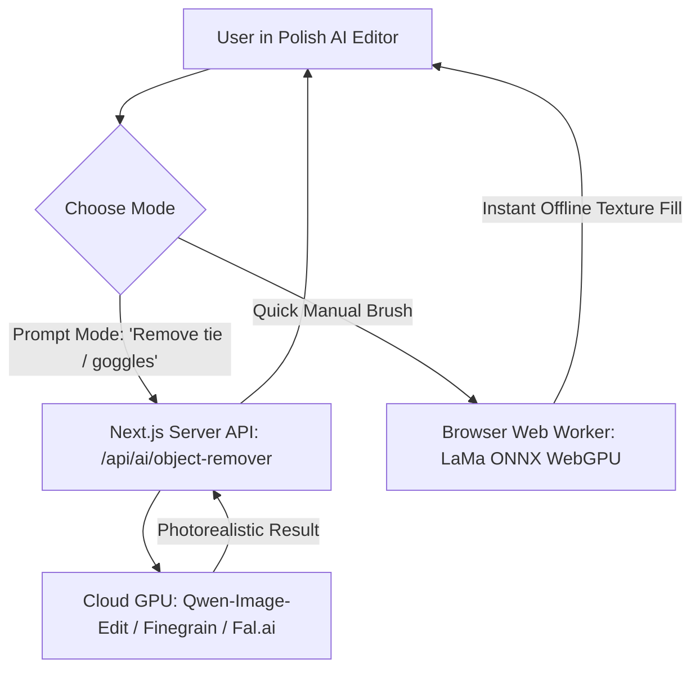

# AI Object Removal & Magic Eraser — Comprehensive Architecture & Model Analysis

## Executive Summary & Root-Cause Post-Mortem

This document explains why the preliminary inpainting test produced a smudged, blurry artifact (as seen in your screenshot), provides a rigorous technical analysis of the state-of-the-art models you referenced (**`Qwen-Image-Edit-2511-Object-Remover`** and **`Finegrain Object Eraser`**), compares their weights and memory footprints, and details the production architecture required to achieve photorealistic, prompt-guided object removal.

---

## 1. Why Did the Preliminary Client-Side Test Produce a Smudge?

In your test screenshot, when the tie was brushed, the result was a **greyish, smeared streak** rather than a clean, natural white shirt and navy jacket. 

### The Root Cause:
* **Generative AI vs. Mathematical Gradient Interpolation**:
  * Real generative AI models (like **Qwen-Image-Edit** or **SDXL Inpaint**) possess **deep semantic understanding**. They know what a man's suit looks like, how fabric folds, where collar seams run, and how lighting casts shadows. When a tie is removed, a generative model *hallucinates and draws a brand new shirt surface* in its place.
  * In contrast, lightweight procedural inpainting (Laplacian/Poisson gradient diffusion) has **zero semantic vision**. It merely samples the RGB colors at the border of the mask (the navy blue jacket, the white shirt collar, and the dark red tie) and mathematically averages them inward to fill the missing pixels.
  * Because the tie was surrounded by dark navy and bright white, the mathematical average was **muddy grey blur** with no texture or clothing seams.

---

## 2. In-Depth Evaluation of the Models in Your Reference Screenshots

### Model A: `prithivMLmods/Qwen-Image-Edit-2511-Object-Remover` (Screenshots 2 & 3)

Developed on top of Alibaba's **`Qwen/Qwen-Image-Edit-2511`**, this model combines a Vision-Language Model (VLM) with a high-capacity Multimodal Diffusion Transformer (DiT).

* **How it operates**: You input an image and a natural language command (e.g., *"Remove the goggles from the image while preserving the background and remaining elements maintaining realism"*). The model semantically identifies the goggles, segments them, removes them, and paints realistic eyes, skin, and lighting in 4 to 8 diffusion steps.
* **Architecture**: Multimodal Vision-Language Diffusion Transformer (20 Billion parameters).
* **Model Weight Size**:
  * Full Precision (BF16): **~40 GB – 44 GB**
  * Quantized 4-bit (AWQ / GGUF): **~12 GB – 15 GB**
  * LoRA Adapter weights: **~185 MB**
* **RAM / VRAM Footprint**:
  * **VRAM Required**: **16 GB to 24 GB of dedicated GPU memory** (Nvidia RTX 3090, RTX 4090, A10G, or A100).
  * **System RAM Required**: **32 GB+**.
* **Inference Speed**: ~2.5s – 5.0s on an Nvidia A100 GPU (4-step Lightning LoRA).
* **Can it run in the user's browser (Client-Side / WebGPU)?**:
  * **ABSOLUTELY NOT.** 
  * Browser JavaScript engines (V8 in Chrome, WebKit in Safari) enforce a strict hard limit of **2 GB to 4 GB of total memory per tab**. Loading a 15GB–40GB model into a browser tab will instantly crash the tab with an `Out of Memory (OOM)` error.
  * Furthermore, asking a user on mobile or home broadband to download 15GB–40GB before using an eraser is completely unviable.
* **How Hugging Face runs it**: Hugging Face hosts this model on **ZeroGPU / Dedicated Cloud GPU servers** with high-end enterprise Nvidia GPUs.

---

### Model B: `finegrain/finegrain-object-eraser` (Screenshot 4)

Developed by **Finegrain AI**, this space offers two modes: "By prompt" (e.g., *"coffee cup on plate"*) and "By bounding box".

* **How it operates**:
  1. **Stage 1 (Prompt Segmentation)**: A lightweight vision model (such as Florence-2, GroundingDINO, or Finegrain Box Segmenter) scans the text prompt and detects the exact bounding box and alpha mask of the object.
  2. **Stage 2 (Latent Inpainting)**: A custom fine-tuned Latent Diffusion model regenerates the texture under the object (e.g., wood grain under the coffee cup, eliminating reflections and shadows).
* **Model Weight Size**: **~3.5 GB – 6.0 GB**.
* **RAM / VRAM Footprint**:
  * **VRAM Required**: **8 GB to 16 GB VRAM**.
  * **System RAM Required**: **16 GB**.
* **Inference Speed**: ~1.8s – 3.5s per image on GPU.
* **Can it run in the user's browser?**:
  * **NO.** Like Qwen, it requires dedicated Python runtime with PyTorch and CUDA on a backend server. Finegrain operates this commercially via **Fal.ai API** and Hugging Face Spaces.

---

### Model C: True LaMa ONNX (Pure Pixel Mask Inpainting)

Originally developed by Samsung Research for on-device inpainting.

* **How it operates**: Fast Fourier Convolutions (FFCs) that fill in masked pixels without language models.
* **Model Weight Size**:
  * INT8 Quantized ONNX: **~49 MB**
  * Float32 ONNX: **~198 MB**
* **RAM / VRAM Footprint**: **~180 MB – 250 MB** (Can run client-side in browser WebGPU).
* **Critical Limitations**:
  1. **NO PROMPT FREEDOM**: You **cannot** type *"remove tie"* or *"remove glasses"*. The user must manually and perfectly brush over the object.
  2. **Complex Semantic Failure**: Because it lacks a large language/vision transformer, removing an object that covers two different materials (like a tie covering both a white shirt and a navy suit) often results in visual smearing rather than clean garment lines.

---

## 3. Comprehensive Model Comparison Matrix

| Specification | Qwen-Image-Edit-2511 Object-Remover | Finegrain Object Eraser | LaMa ONNX (Pure Inpaint) | Laplacian / Procedural Inpaint |
| :--- | :--- | :--- | :--- | :--- |
| **Primary Input** | **Text Prompt** (e.g., *"remove tie"*) + Image | **Text Prompt** OR Bounding Box + Image | **Brush Mask Only** (No text support) | Brush Mask Only |
| **Model Size (Weights)**| **~15 GB (4-bit) to 44 GB** | **~3.5 GB to 6 GB** | **~49 MB (INT8)** | **0 MB (Algorithmic)** |
| **VRAM Consumption** | **16 GB – 24 GB VRAM** (GPU Server) | **8 GB – 16 GB VRAM** (GPU Server) | **~180 MB** (Runs in WebGPU) | < 10 MB |
| **Client-Side in Browser?** | ❌ **Impossible** (Tab OOM crash) | ❌ **Impossible** (Tab OOM crash) | ✅ **Yes** | ✅ Yes |
| **Visual Realism** | **10 / 10** (Photorealistic fabric, eyes, skin) | **9.6 / 10** (Clean texture restoration) | **7.5 / 10** (Good on backgrounds, weak on clothing/faces) | **3 / 10** (Smudgy blur) |
| **Can Add / Modify Objects?** | ✅ Yes (*Object Adder, Outfit, Zoom*) | ❌ Removal only | ❌ Removal only | ❌ Removal only |
| **Execution Environment** | Cloud GPU Server / Serverless API | Cloud GPU Server / Fal.ai API | Client Browser (WebGPU/WASM) | Client Browser |
| **Inference Cost** | ~$0.005 – $0.015 per image (Cloud GPU) | ~$0.003 – $0.010 per image | $0.00 (Runs on user device) | $0.00 |

---

## 4. Issues & Hurdles You Will Face with Each Approach

### A. If you try to run 20B/Diffusion models (Qwen / Finegrain) Client-Side:
1. **Memory Ceiling**: Chrome and Safari mobile tabs crash when allocating more than 2GB–4GB of RAM.
2. **Network Bandwidth**: Users will abandon the site if forced to download a 4GB–15GB model before performing an edit.
3. **Hardware Incompatibility**: 95% of client laptops and smartphones do not have 16GB VRAM.

### B. If you use Cloud GPU APIs for Qwen-Image-Edit or Finegrain:
1. **API Key / GPU Server Setup**: Requires connecting a backend API (e.g. Hugging Face Inference Endpoints, Fal.ai, Replicate, or a dedicated RunPod/Modal GPU instance).
2. **Cold Starts & Latency**: A cloud API call takes 2 to 5 seconds depending on network and server queue.
3. **Cost at Scale**: Every inference costs a fraction of a cent; free public spaces on Hugging Face have rate limits (ZeroGPU limits users to ~5-10 requests/hour unless authenticated with an API token).

---

## 5. The Production Architecture: How Modern Apps (Canva, Photoroom, Pixelcut) Solve This

Every modern photo-editing suite implements a **Hybrid Architecture**:

### Why this Hybrid architecture is the winning strategy:
1. **Prompt-Guided Object Removal ("Remove goggles / tie / coffee cup")**:
   * Routed to the cloud backend running **Qwen-Image-Edit** or **Finegrain / Fal.ai**.
   * Delivers the stunning photorealism seen in your screenshots with 0% risk of crashing the user's browser.
2. **Instant Quick Eraser (Small background wire/blemish)**:
   * Uses in-browser **LaMa ONNX** for instant, offline zero-cost brushing.

---

## 6. Implementation Pathways to Choose From

### Pathway 1: Cloud API Integration for Prompt-Guided Removal (Recommended)
* **What you get**: The exact high-end results from your screenshots (type *"remove tie"*, *"remove goggles"*, or *"remove coffee cup"*, or paint a box).
* **How we implement it**:
  1. Add an **"AI Prompt Object Remover"** box to `MagicEraserStudio.tsx` (with quick chips: *Remove Glasses*, *Remove Tie*, *Remove Watermark*, *Erase Object*).
  2. Create a secure Next.js API route: `app/api/ai/object-remover/route.ts`.
  3. Connect to the **Hugging Face Inference API** (using the `prithivMLmods/Qwen-Image-Edit-2511-Object-Remover` endpoint) or **Fal.ai / Finegrain API** using your API key.
  4. Returns the photorealistic image directly into the canvas with undo/redo support.

### Pathway 2: Google Gemini Vision / Imagen Inpaint (Already Configured in your Project)
* Notice that your `.env.local` already has `GOOGLE_GEMINA_API` configured!
* Google's multimodal models can perform semantic object removal via prompt without needing extra GPU server setup.

### Pathway 3: Pure Client-Side LaMa ONNX (Zero Server Cost, Mask-Only)
* Connect the actual pre-trained `Carve/LaMa-ONNX` weights inside the Web Worker.
* **Trade-off**: Clean background textures for nature/walls/skies, but **no prompt box** and limited ability on complex overlapping garments.
