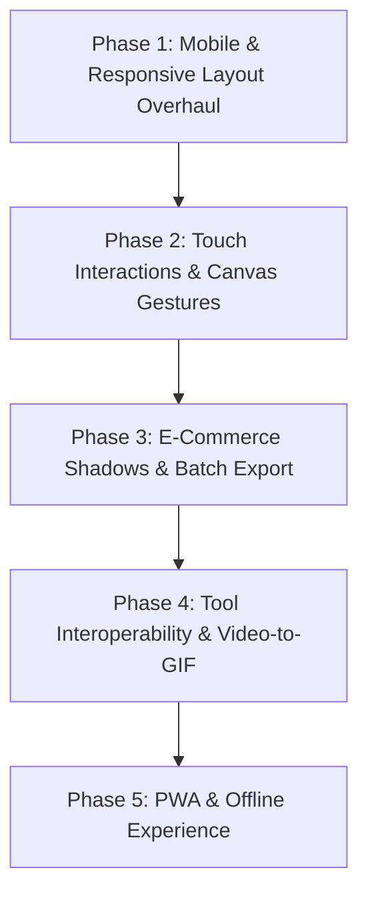

# Polish AI — Comprehensive Responsive Architecture & Feature Expansion Plan

## Executive Summary

This document outlines the master architectural plan for **Polish AI — Pro Image & GIF Studio**. It is organized into two primary pillars:

1. **Complete Cross-Device Responsive Blueprint**: A systematic Tailwind CSS strategy to ensure every tool (Canvas Studio, Background Remover, GIF Timeline Animator, Dashboards, and Landing Experience) adapts fluidly across Mobile (`<640px`), Tablet (`768px–1024px`), Desktop (`1024px–1536px`), and Ultra-wide (`>1536px`) displays.
2. **High-Value Product Feature Roadmap**: Curated high-impact features that transform Polish AI into an indispensable, commercial-grade creative suite for content creators, e-commerce sellers, marketers, and designers.

---

## Part 1: Cross-Device Responsive Architecture (Mobile, Tablet, Desktop, Ultra-Wide)

### 1.1 Responsive Breakpoint & Layout System

We standardize on a 5-tier responsive breakpoint matrix leveraging Tailwind CSS core utilities:

| Tier | Screen Width | Device Targets | Layout Paradigm |
| :--- | :--- | :--- | :--- |
| **Mobile (Compact)** | `< 640px` (`sm`) | iPhone, Android phones | Single-column, floating bottom action bar, bottom sheet drawers for layers/tools, full-bleed canvas. |
| **Mobile (Large / Phablet)** | `640px – 767px` (`sm` to `md`) | Foldables, large smartphones in landscape | Adaptive 2-column drawer, compact header with icon-only badges. |
| **Tablet (Portrait & Landscape)** | `768px – 1023px` (`md` to `lg`) | iPad Mini, iPad 10.9", Galaxy Tab | Collapsible sidebar docks, touch-optimized tool palettes, responsive timeline scrubber. |
| **Desktop / Laptop** | `1024px – 1535px` (`lg` to `2xl`) | MacBooks, 13"–16" Laptops, 1080p monitors | 3-column studio layout (Left: Tools, Center: Canvas Workspace, Right: Layers & Properties). |
| **Ultra-Wide / Workstation** | `≥ 1536px` (`2xl+`) | 27" 4K, 34"+ curved ultra-wides | Centered bounded workspace, dual pin-open inspector panels, expanded multi-track filmstrip. |

---

### 1.2 Studio Component-by-Component Responsive Architecture

#### A. Image Editing Studio (`/image-editing`)

```
┌────────────────────────────────────────────────────────────────────────┐
│ Desktop (lg/xl/2xl): 3-Column Studio                                    │
│ [TopBar: Name | Zoom | Undo/Redo | Actions | Export]                  │
├──────────────┬──────────────────────────────────────────┬──────────────┤
│ Tools Panel  │ Canvas Workspace (Infinite Centered)     │ Layers Panel │
│ (280px Dock) │ Auto-scaled Fabric.js Canvas + Zoom Pan  │ (300px Dock) │
└──────────────┴──────────────────────────────────────────┴──────────────┘

┌────────────────────────────────────────────────────────────────────────┐
│ Mobile (< md): Single-View Canvas + Bottom App Bar & Drawers           │
│ [Compact TopBar: Back | Undo/Redo | Zoom % | Export]                   │
├────────────────────────────────────────────────────────────────────────┤
│                                                                        │
│                      Full-Bleed Responsive Canvas                      │
│                                                                        │
├────────────────────────────────────────────────────────────────────────┤
│ [Floating Tool Sheet Drawer] (Opens upwards on touch: Crop, Text, etc) │
├────────────────────────────────────────────────────────────────────────┤
│ Bottom Bar: [Tools Icon] [Layers (Badge)] [Filters] [Transform] [Save] │
└────────────────────────────────────────────────────────────────────────┘
```

1. **Fabric.js Canvas Responsive Viewport**:
   * *Problem on mobile*: Fabric canvas fixed pixel width/height overflows small screens.
   * *Solution*: Implement a responsive canvas container with `resizeObserver` that scales the visual zoom factor `canvas.setZoom(scale)` while keeping original export resolution intact.
   * *Tailwind pattern*: `relative flex-1 w-full h-[calc(100dvh-120px)] md:h-[calc(100dvh-60px)] overflow-hidden`.
2. **Left Tools Panel (`EditorToolsPanel.tsx`)**:
   * **Desktop (`lg+`)**: Fixed left sidebar `w-72 lg:w-80 shrink-0 border-r border-white/10`.
   * **Tablet (`md` to `lg`)**: Collapsible icon sidebar (`w-16`) that expands on hover/tap.
   * **Mobile (`< md`)**: Rendered as a swipeable bottom sheet (`fixed inset-x-0 bottom-16 max-h-[60vh] rounded-t-3xl bg-[#09101d] border-t border-white/10 p-4 transition-transform z-40`).
3. **Right Layers Panel (`EditorLayerPanel.tsx`)**:
   * **Desktop (`lg+`)**: Persistent right sidebar `w-72 lg:w-80 shrink-0 border-l border-white/10`.
   * **Mobile / Tablet**: Triggered via a badge button (`[Layers 3]`) opening a modal drawer with reorder handle gestures.
4. **Studio TopBar (`EditorTopBar.tsx`)**:
   * **Mobile**: Group non-essential buttons into a dropdown menu (`...`). Show only `Back`, `Undo/Redo`, and `Export` primary button.

---

#### B. AI Background Removal Studio (`/image-bg-removal`)

```
┌────────────────────────────────────────────────────────────────────────┐
│ Desktop: Side-by-Side Live Compare or Large Split-Slider View          │
│ Left: Original Image                    Right: Transparent Cutout      │
│ [Backdrop Selector: Transparent | Color Presets | Studio Shadow]       │
└────────────────────────────────────────────────────────────────────────┘

┌────────────────────────────────────────────────────────────────────────┐
│ Mobile: Stacked View with Touch Split-Slider                           │
│ [Top: Interactive Split Slider (Auto-fit aspect ratio)]               │
│ [Middle: Horizontal Scrolling Backdrop Swatches]                       │
│ [Bottom: Action Toolbar: Selective Prompt, Inpainting, Download]       │
└────────────────────────────────────────────────────────────────────────┘
```

1. **Touch-Optimized Split-Slider**:
   * Support `onTouchStart`, `onTouchMove`, and `onTouchEnd` alongside mouse drag.
   * Add a larger touch-target thumb (`w-10 h-10` with vibration/haptic feedback on mobile browsers).
   * Tailwind: `touch-none select-none cursor-ew-resize`.
2. **Horizontal Scrolling Backdrop & Cutout Bar**:
   * Use smooth horizontal scroll with hidden scrollbar:
   * Tailwind: `flex gap-2 overflow-x-auto no-scrollbar py-2 px-4 -mx-4`.
3. **Batch Processing Queue**:
   * On mobile: Swipeable carousel of thumbnails at the bottom.
   * On desktop: Dedicated sidebar drawer with batch upload dropzone.

---

#### C. GIF Maker & Timeline Animator (`/gif-maker`)

1. **Responsive Filmstrip Timeline (`GifTimeline.tsx`)**:
   * **Desktop (`lg+`)**: Full-width bottom dock (`h-44`) with frame cards (`w-28 h-28`), frame numbering, active playhead, and timing controls.
   * **Mobile (`< md`)**: Compact timeline dock (`h-28`) with micro-thumbnails (`w-16 h-16`), horizontal swipe, play/pause floating action button, and frame count badge.
2. **Animation Decks (`ElementAnimationDeck.tsx` & `TransitionStudioDeck.tsx`)**:
   * **Desktop**: Tabbed inspector on the right or modal flyout.
   * **Mobile**: Full-screen overlay or bottom drawer with easy touch sliders for duration (e.g., 4f, 8f, 12f) and motion presets (Fade, Slide, Bounce).

---

#### D. Dashboards & Presets (`/image-home-screen` & `/gif-home-screen`)

1. **Preset Card Grid**:
   * Tailwind: `grid grid-cols-1 sm:grid-cols-2 lg:grid-cols-3 xl:grid-cols-4 gap-4 sm:gap-6`.
2. **Project Action Modals**:
   * Full-width responsive dialogs: `w-full max-w-lg mx-4 rounded-3xl p-6 sm:p-8`.

---

#### E. Landing Page & Global Header / Footer

1. **Header Navigation (`Header.tsx`)**:
   * Mobile drawer with glassmorphism backdrop (`backdrop-blur-2xl bg-[#091528]/95`), animated hamburger icon, and touch-friendly link targets (`py-3.5 px-4 rounded-2xl`).
2. **Hero Showcase Split Slider (`HeroProductShowcase.tsx`)**:
   * Bounded responsive container: `aspect-[4/3] sm:aspect-[16/10] md:aspect-[16/9] max-h-[520px] w-full`.
3. **Feature Cards (`ProductPillarsSection.tsx`)**:
   * `grid grid-cols-1 md:grid-cols-2 lg:grid-cols-3 gap-6 sm:gap-8`.

---

### 1.3 Key Tailwind CSS Utilities for Mobile & Touch Ergonomics

```css
/* Touch Ergonomics & Safe Areas */
.pb-safe { padding-bottom: env(safe-area-inset-bottom, 16px); }
.pt-safe { padding-top: env(safe-area-inset-top, 16px); }

/* Prevent accidental browser gestures on canvas */
.canvas-touch-guard {
  touch-action: none;
  overscroll-behavior: contain;
  user-select: none;
  -webkit-user-select: none;
}

/* Fluid Typography */
.text-fluid-title {
  font-size: clamp(1.75rem, 4vw + 1rem, 3.75rem);
}
```

---

## Part 2: High-Value Features Recommended to Add

These features will provide the highest perceived value to end users, differentiate Polish AI from standard editors, and drive retention:

### Feature 1: E-Commerce Product Studio with Contact & Floating Shadows
* **What it does**: When a user removes a background from a product (shoes, bottle, electronics), placing it on pure white or a colored background often looks flat or fake. This feature automatically generates a realistic **Contact Shadow** or **Soft Ambient Drop Shadow** beneath the object.
* **Why users love it**: Essential for Amazon, Shopify, Etsy, and eBay sellers who need professional product photos in seconds without Photoshop.
* **Implementation**:
  * Canvas blur filter with directional offset `y` and perspective skewing.
  * Presets: *Floor Contact Shadow*, *Floating Soft Glow*, *Directional Sunlight Shadow*.

### Feature 2: Client-Side Neural Magic Eraser (Object Inpainting)
* **What it does**: Allows the user to paint a brush over an unwanted tourist, power line, or watermark and cleanly erase it using browser-based inpainting.
* **Why users love it**: One of the most viral photo-editing features on smartphones (Google Magic Eraser).
* **Implementation**:
  * Run LaMa or Slim-MMSegmentation ONNX model directly inside `_workers/inpaint.worker.ts` with WebGPU/WASM.
  * Real-time brush size and feathering control in `MaskStudio.tsx`.

### Feature 3: Smart Social Aspect Ratio Reframe (1-Click Multi-Format Export)
* **What it does**: Automatically converts a single design into all social media dimensions at once:
  * Instagram Post (`1:1`)
  * Instagram Story / TikTok (`9:16`)
  * YouTube Thumbnail (`16:9`)
  * Twitter / LinkedIn Header (`3:1`)
* **Why users love it**: Saves social media creators and agencies hours of manual resizing.

### Feature 4: Batch Background Removal with 1-Click ZIP Export
* **What it does**: Allows users to drop 10 to 50 images at once. Polish AI processes them in parallel (using Web Workers without freezing the UI) and downloads them in a single `.zip` file with transparent PNGs or WebP cutouts.
* **Why users love it**: Commercial photographers and catalogue managers need bulk operations.
* **Implementation**:
  * Built on existing `JSZip` and `file-saver` libraries already installed in the repo.

### Feature 5: Seamless Hand-off Between Tools (Unified Creative Pipeline)
* **What it does**: Connects the 3 standalone tools into one seamless workflow:
  * Remove Background on `/image-bg-removal` $\rightarrow$ 1-Click **"Open in Canvas Studio"** (adds cutout as a layer with shadows and text).
  * Design graphic in `/image-editing` $\rightarrow$ 1-Click **"Animate as GIF"** in `/gif-maker`.
* **Why users love it**: Creates a unified suite feel rather than disconnected utilities.

### Feature 6: Video-to-GIF Trimmer & High-Speed Converter
* **What it does**: Drop an MP4, MOV, or WebM video file, select a 2 to 5-second slice on a video scrubber, set frame rate (10, 15, 24 FPS), and convert directly to an animated GIF or vice-versa.
* **Why users love it**: Memes, reaction clips, and animated tutorial loops.
* **Implementation**:
  * Leverage `@ffmpeg/ffmpeg` and `@ffmpeg/util` (already present in `package.json`).

### Feature 7: Undo / Redo History Visualizer & Keyboard Shortcuts
* **What it does**:
  * `Ctrl+Z` / `Cmd+Z`: Undo
  * `Ctrl+Y` / `Cmd+Shift+Z`: Redo
  * `Space + Drag`: Pan Canvas
  * `Delete` / `Backspace`: Remove selected layer
  * Visual history step list showing past 20 operations (e.g., "Add Text", "Change Filter", "Move Layer").

### Feature 8: Offline PWA & Cloud Project Synchronization
* **What it does**:
  * Enables full offline capability via Service Worker so users can edit images and make GIFs even without internet access.
  * Persists projects in browser `IndexedDB` (using `idb-keyval`) with optional Appwrite/MongoDB cloud backup for authenticated users.

---

## Part 3: Phased Implementation Roadmap



### Phase 1: Responsive Layout Foundations (Week 1)
- [ ] Add mobile bottom action bar and responsive drawers to `/image-editing`.
- [ ] Implement responsive touch-safe split slider for `/image-bg-removal`.
- [ ] Adapt `/gif-maker` timeline to auto-collapse cards on mobile screens (`<640px`).
- [ ] Add `resizeObserver` auto-scaling to `EditorCanvasWorkspace.tsx`.

### Phase 2: Touch Ergonomics & Gestures (Week 2)
- [ ] Implement two-finger pinch-to-zoom and two-finger canvas pan on mobile.
- [ ] Add haptic feedback and tap-to-select layer behaviors on touch devices.
- [ ] Build floating mobile quick-action wheel (Delete, Duplicate, Flip, Layer Up/Down).

### Phase 3: E-Commerce Product Studio & Batch Tools (Week 3)
- [ ] Add automatic Contact Shadow and Ambient Shadow generator to `/image-bg-removal`.
- [ ] Build multi-file batch upload queue with progress indicators and `JSZip` export.
- [ ] Add pre-configured E-commerce backdrop templates (Studio White, Soft Pastel, Neon Podium).

### Phase 4: Creative Pipeline & Media Hand-Off (Week 4)
- [ ] Add "Export to Canvas Studio" button in Background Remover.
- [ ] Add "Send to GIF Maker" button in Image Editing Studio.
- [ ] Implement Video-to-GIF timeline converter using client-side `@ffmpeg/ffmpeg`.
